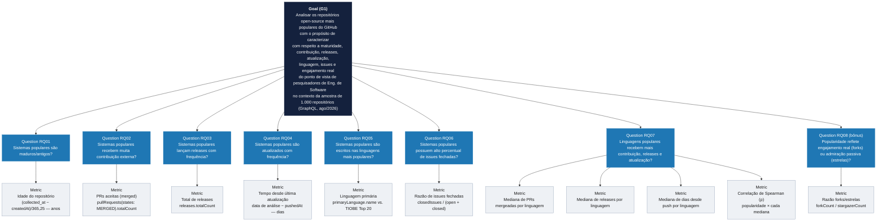
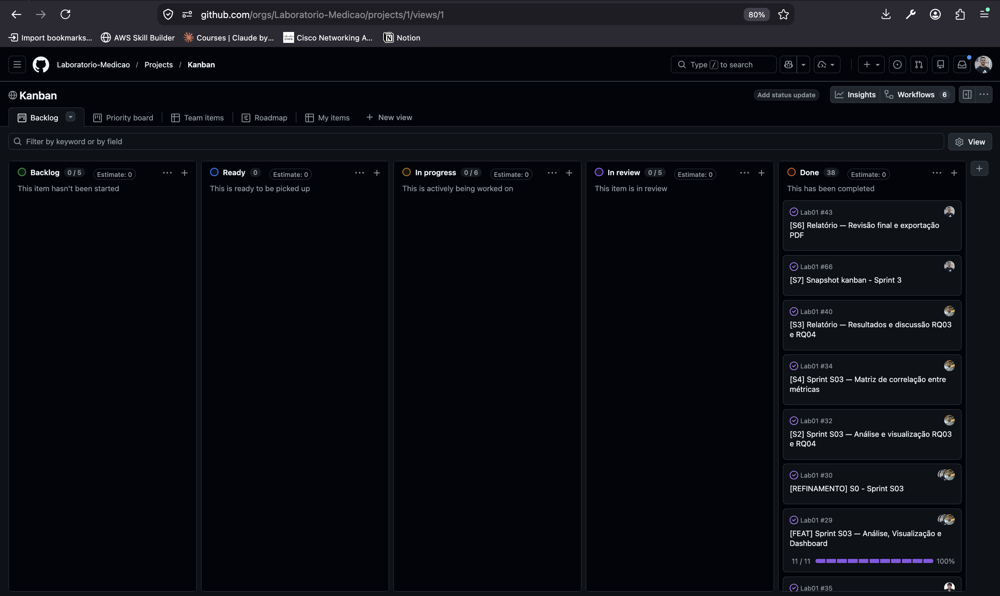

<h1 align="center">Relatório de Laboratório</h1>

| | |
|---|---|
| **Curso** | Engenharia de Software |
| **Disciplina** | Laboratório de Experimentação de Software |
| **Turno / Período** | Noite / 6º |
| **Professor(a)** | Danilo Maia |
| **Laboratório** | Lab01 — Características de Repositórios Populares + Setup do Kanban |
| **Grupo (trio)** | Arthur Luiz Alves Soares  · Guilherme de Almeida Rocha Vieira · Marcos Alberto Ferreira Pinto  |
| **Link do repositório / GitHub Projects** | https://github.com/Laboratorio-Medicao/Lab01 / https://github.com/orgs/Laboratorio-Medicao/projects/1 |
| **Data de entrega** | 28/08/2026 |

---

## 1. Introdução

Este laboratório investiga as principais características dos sistemas open-source mais populares hospedados no GitHub. A popularidade foi operacionalizada pelo número de estrelas (stars) de cada repositório — proxy amplamente utilizado na literatura de engenharia de software para medir relevância e adoção de projetos. A motivação é entender se repositórios com alta visibilidade compartilham padrões comuns de maturidade, contribuição externa, frequência de releases, atualização e escolha de linguagem.

Foram coletados os **1.000 repositórios com maior número de estrelas no GitHub** via API GraphQL, com coleta realizada em agosto de 2026. O estudo responde às seguintes questões de pesquisa:

- **RQ01.** Sistemas populares são maduros/antigos? *(métrica: idade do repositório a partir da data de criação)*
- **RQ02.** Sistemas populares recebem muita contribuição externa? *(métrica: total de pull requests aceitas)*
- **RQ03.** Sistemas populares lançam releases com frequência? *(métrica: total de releases)*
- **RQ04.** Sistemas populares são atualizados com frequência? *(métrica: tempo desde a última atualização)*
- **RQ05.** Sistemas populares são escritos nas linguagens mais populares? *(métrica: linguagem primária de cada repositório, comparada ao TIOBE Index de agosto de 2026)*
- **RQ06.** Sistemas populares possuem um alto percentual de issues fechadas? *(métrica: razão entre issues fechadas e total de issues)*
- **RQ07.** Sistemas escritos em linguagens mais populares recebem mais contribuição externa, lançam mais releases e são atualizados com mais frequência? *(métrica: RQ02, RQ03 e RQ04 agrupados por linguagem primária)*

Como inovação própria (30%), o grupo propôs a **RQ08**, que mede a razão forks/estrelas como proxy de engajamento real versus popularidade passiva, e implementou uma **arquitetura de coleta tolerante a falhas** via fila de jobs com RabbitMQ — detalhes na seção 3.6.

### Hipóteses Informais

#### RQ01 — Maturidade dos repositórios

**Hipótese:** a maior parte dos repositórios populares acumula estrelas ao longo de vários anos — a mediana de idade deve ficar acima de 3 anos. Haverá uma cauda de repositórios jovens (< 1,5 anos) associada principalmente ao fenômeno de star-farming e ao hype de IA/agentes observado em 2025–2026, mas essa cauda não deve representar a maioria da amostra.

**Justificativa:** popularidade orgânica é um processo cumulativo; picos de crescimento rápido em poucos meses são exceção, não regra, mesmo entre os repositórios mais estrelados do GitHub.

#### RQ02 — Contribuição externa

**Hipótese:** a distribuição de pull requests aceitas deve ser fortemente assimétrica à direita — a maioria dos repositórios terá uma contagem relativamente baixa de PRs mergeadas, com uma cauda de outliers formada por projetos de infraestrutura madura (linguagens, frameworks, ferramentas de uso massivo).

**Justificativa:** contribuição via pull request depende de uma comunidade ativa de terceiros, que só se forma depois de o projeto ser amplamente conhecido e adotado.

#### RQ03 — Frequência de releases

**Hipótese:** a maioria dos repositórios populares deve ter um número moderado de releases, com outliers de projetos que adotam versionamento semântico rigoroso. Projetos de documentação, listas curadas e materiais de aprendizado devem puxar a mediana para baixo, por não seguirem o ciclo de release convencional.

**Justificativa:** o total de releases depende tanto da maturidade do projeto quanto da política de versionamento adotada — um projeto maduro com entrega contínua pode ter zero releases formais no GitHub, enquanto um projeto jovem com versionamento semântico estrito pode ter dezenas.

#### RQ04 — Frequência de atualização

**Hipótese:** a maioria dos repositórios populares deve ter sido atualizada recentemente (mediana de dias desde o último push abaixo de 30 dias). Porém, uma parcela de repositórios históricos — projetos concluídos, arquivados ou de referência estática — deve apresentar longos períodos sem atividade, formando a cauda da distribuição.

**Justificativa:** sistemas com alta popularidade tendem a atrair usuários que reportam bugs e sugerem melhorias, o que mantém os mantenedores ativos. Exceções naturais são projetos considerados "completos" ou repositórios de conteúdo estático.

#### RQ05 — Linguagens mais populares

**Hipótese:** Python e JavaScript devem ocupar as primeiras posições da distribuição. C e C++ devem aparecer em seguida, puxados por projetos de sistemas com grande base de estrelas acumulada. A maioria das linguagens com representação expressiva na amostra deve coincidir com o top 20 do TIOBE Index. A principal exceção esperada é TypeScript, que tem forte presença no GitHub mas não aparece no top 20 do TIOBE.

**Fonte de referência:** TIOBE Index, agosto de 2026 — https://www.tiobe.com/tiobe-index/

**Justificativa:** o TIOBE mede popularidade com base em buscas globais; linguagens com maior adoção tendem a dominar tanto as buscas quanto os repositórios mais populares do GitHub. TypeScript é uma exceção estrutural por ser um superset de JavaScript voltado especificamente para projetos de médio/grande porte.

#### RQ06 — Percentual de issues fechadas

**Hipótese:** a mediana da razão `closed_issues / total_issues` deve ficar acima de 0,5, com distribuição assimétrica à esquerda — concentrada perto de 1,0 — e uma cauda de projetos muito ativos onde a taxa de abertura de novas issues supera a de fechamento.

**Justificativa:** projetos open-source populares costumam ter mantenedores ativos que fecham issues regularmente. À medida que o projeto cresce, o volume de issues abertas tende a crescer mais rápido do que a capacidade de resolução, especialmente em projetos sem equipe dedicada de suporte.

#### RQ07 — Linguagem vs. contribuição, releases e atualização

**Hipótese:** linguagens mais populares não devem apresentar correlação forte e consistente com todas as métricas de RQ02, RQ03 e RQ04 simultaneamente. É esperada correlação moderada com PRs mergeadas, mas correlação fraca com releases e atualização, pois essas métricas dependem mais da política interna de cada projeto do que da linguagem usada.

**Justificativa:** a popularidade da linguagem influencia o tamanho potencial da comunidade de contribuidores (RQ02), mas não determina a frequência de releases (RQ03) nem a atividade de push (RQ04), que são decisões de governança do projeto.

#### RQ08 — Engajamento real (bônus)

**Hipótese:** repositórios no grupo suspeito de star-farming (idade < 1,5 anos e mais de 100 mil estrelas) devem ter `fork_star_ratio` (fork_count / stargazer_count) sistematicamente mais baixo que o resto da amostra — estrelas compradas/automatizadas não se traduzem em forks, enquanto adoção orgânica gera ambos proporcionalmente.

**Justificativa:** forks exigem uma ação deliberada de quem pretende usar, estudar ou contribuir com o código — um sinal de engajamento ativo bem mais custoso de forjar em massa do que uma estrela, que é um clique único sem intenção necessária de uso.

---

## 2. Contexto

Este é o Lab01 da disciplina, primeiro da sequência de cinco laboratórios do semestre. O board Kanban criado aqui será mantido e utilizado como objeto de estudo nos Labs 04 e 05; os snapshots exportados ao final de cada sprint constituirão a série histórica de dados para esses laboratórios futuros.

O objeto de estudo é o conjunto dos **1.000 repositórios com maior número de estrelas no GitHub** em agosto de 2026 — um recorte que captura sistemas de diferentes domínios, idades e linguagens, unificados pelo critério de alta visibilidade na plataforma.

Como referência para "linguagens de programação mais populares" (RQ05), o grupo adotou o **TIOBE Index** (tiobe.com/tiobe-index), edição de agosto de 2026, mantendo esta fonte como única referência ao longo de todo o laboratório.

---

## 2.1 Estrutura GQM

Medir software sem uma pergunta de pesquisa por trás produz números sem interpretação — coletar uma métrica não é, por si só, medir algo com sentido (ZUSE, 2013). Esta seção formaliza, no modelo **Goal-Question-Metric** (Basili, Caldiera & Rombach, 1994), a estrutura que já orienta implicitamente as seções 1 e 3.5 deste relatório: um objetivo único de investigação, do qual derivam 8 questões de pesquisa no total — as **7 RQs obrigatórias do enunciado (RQ01–RQ07)** mais a **RQ08, inovação própria do grupo (seção 3.6)** —, cada uma respondida por uma ou mais métricas já definidas e coletadas. Nenhuma métrica nova é introduzida aqui — o GQM apenas explicita a hierarquia que já estava implícita entre a Introdução (seção 1) e a Tabela de Métricas (seção 3.5).

### Goal (G1)

> **Analisar** os repositórios open-source mais populares do GitHub
> **com o propósito de** caracterizar
> **com respeito a** maturidade, contribuição externa, frequência de releases, atualização, aderência às linguagens mais populares, gestão de issues e engajamento real
> **do ponto de vista de** pesquisadores de Engenharia de Software
> **no contexto de** uma amostra dos 1.000 repositórios com maior número de estrelas no GitHub, coletada via API GraphQL em agosto de 2026.

### Árvore GQM



**Versão em texto (fallback para exportação em PDF, caso o renderizador não suporte Mermaid):**

```
Goal (G1): Analisar os repositórios open-source mais populares do GitHub
  com o propósito de caracterizar
  com respeito a maturidade, contribuição externa, frequência de releases,
    atualização, aderência às linguagens mais populares, gestão de issues
    e engajamento real
  do ponto de vista de pesquisadores de Engenharia de Software
  no contexto de uma amostra dos 1.000 repositórios com maior número de
    estrelas no GitHub, coletada via API GraphQL em agosto de 2026

├─ Question RQ01 — Sistemas populares são maduros/antigos?
│    └─ Metric: Idade do repositório
├─ Question RQ02 — Sistemas populares recebem muita contribuição externa?
│    └─ Metric: Total de pull requests aceitas (merged)
├─ Question RQ03 — Sistemas populares lançam releases com frequência?
│    └─ Metric: Total de releases
├─ Question RQ04 — Sistemas populares são atualizados com frequência?
│    └─ Metric: Tempo desde a última atualização
├─ Question RQ05 — Sistemas populares são escritos nas linguagens mais populares?
│    └─ Metric: Linguagem primária (comparada ao TIOBE Index Top 20)
├─ Question RQ06 — Sistemas populares possuem um alto percentual de issues fechadas?
│    └─ Metric: Razão de issues fechadas
├─ Question RQ07 — Sistemas em linguagens populares recebem mais
│    contribuição, releases e atualizações?
│    ├─ Metric: Mediana de PRs mergeadas por linguagem
│    ├─ Metric: Mediana de releases por linguagem
│    ├─ Metric: Mediana de dias desde o último push por linguagem
│    └─ Metric: Correlação de Spearman (ρ) entre popularidade da linguagem
│         e cada mediana acima
└─ Question RQ08 (bônus) — Sistemas populares atraem apenas admiração
     passiva (estrelas) ou também engajamento ativo (forks)?
     └─ Metric: Razão forks/estrelas (fork_star_ratio)
```

Nota: cada métrica acima só existe porque responde a uma Question específica — nunca o contrário, conforme a ideia central do GQM. RQ07 é a única Question com mais de uma métrica associada, porque uma única medida não é suficiente para responder "linguagens populares recebem mais contribuição, releases *e* atualização?" — são três fenômenos distintos, cada um com sua própria mediana por linguagem, mais a correlação que amarra os três à popularidade da linguagem.

### Tabela de Registro

| Question (RQ) | Metric | Definição Operacional | Responsável |
|---|---|---|---|
| RQ01 | Idade do repositório | `(collected_at − createdAt) / 365,25` (anos) | Marcos Alberto |
| RQ02 | Pull requests aceitas | `pullRequests(states: MERGED).totalCount` | Marcos Alberto |
| RQ03 | Total de releases | `releases.totalCount` | Arthur Soares |
| RQ04 | Tempo desde última atualização | `data de análise − pushedAt` (dias) | Arthur Soares |
| RQ05 | Linguagem primária | `primaryLanguage.name`, comparada ao top 20 do TIOBE Index (ago/2026) | Guilherme Vieira |
| RQ06 | Razão de issues fechadas | `closedIssues / (openIssues + closedIssues)`; indefinida quando total = 0 | Guilherme Vieira |
| RQ07 | Mediana de PRs mergeadas por linguagem | `median(merged_pull_requests)` agrupado por `primary_language` | Guilherme Vieira |
| RQ07 | Mediana de releases por linguagem | `median(releases_count)` agrupado por `primary_language` | Guilherme Vieira |
| RQ07 | Mediana de dias desde último push por linguagem | `median(days_since_push)` agrupado por `primary_language` | Guilherme Vieira |
| RQ07 | Correlação de Spearman (ρ) | ρ entre rank de popularidade da linguagem (nº de repos na amostra) e cada mediana acima | Guilherme Vieira |
| RQ08 (bônus) | Razão forks/estrelas | `forkCount / stargazerCount`; indefinida quando `stargazerCount = 0` | Marcos Alberto |

Responsáveis conforme as Issues do Kanban já registradas na seção 3.3 (#11/#23/#31/#39/#58 → Marcos Alberto; #12/#24/#32/#40 → Arthur Soares; #13/#25/#33/#41 → Guilherme Vieira).

### Tabela de Métricas consolidada (GQM × Seção 3.5)

A tabela abaixo conecta cada métrica à sua Question e ao Goal único (G1), reaproveitando — sem duplicar — as definições operacionais, unidades e fontes já fixadas na Tabela de Métricas da seção 3.5, e acrescentando apenas a coluna de Responsável:

| Goal | Question (RQ) | Metric | Definição Operacional | Unidade | Ferramenta / Fonte | Responsável |
|---|---|---|---|---|---|---|
| G1 | RQ01 | Idade do repositório | `(collected_at − createdAt) / 365,25` | Anos | GraphQL `Repository.createdAt` | Marcos Alberto |
| G1 | RQ02 | Pull requests aceitas | `pullRequests(states: MERGED).totalCount` | Contagem | GraphQL `Repository.pullRequests` | Marcos Alberto |
| G1 | RQ03 | Total de releases | `releases.totalCount` | Contagem | GraphQL `Repository.releases` | Arthur Soares |
| G1 | RQ04 | Tempo desde última atualização | `data de análise − pushedAt` | Dias | GraphQL `Repository.pushedAt` | Arthur Soares |
| G1 | RQ05 | Linguagem primária | `primaryLanguage.name`; comparada ao top 20 do TIOBE Index (ago/2026) | Categoria | GraphQL `Repository.primaryLanguage` | Guilherme Vieira |
| G1 | RQ06 | Razão de issues fechadas | `closedIssues / (openIssues + closedIssues)`; indefinida quando total = 0 | Razão [0,1] | GraphQL `issues(states: OPEN/CLOSED).totalCount` | Guilherme Vieira |
| G1 | RQ07 | Métricas de RQ02/03/04 por linguagem | Mediana de cada métrica agrupada por `primary_language`; correlação de Spearman entre rank de popularidade e cada mediana | Mediana + ρ | Banco de dados (SQL `GROUP BY`) | Guilherme Vieira |
| G1 | RQ08 (bônus) | Razão forks/estrelas | `forkCount / stargazerCount`; indefinida quando `stargazerCount = 0` | Razão [0, +∞) | GraphQL `Repository.forkCount` | Marcos Alberto |

Definições operacionais completas de cada métrica — incluindo tratamento de valores ausentes, casos de borda e decisões metodológicas — permanecem detalhadas na seção 3.5 e em `docs/metodologia.md`, para não duplicar conteúdo entre as duas seções.

---

## 3. Metodologia

### 3.1 Principais Desafios

**Rate limit da API GraphQL do GitHub:** a coleta de 1.000 repositórios em lotes de 25 por requisição está sujeita ao limite de taxa da API. Quando o limite é atingido, a coleta precisa ser pausada até a janela de reset — sem persistência de estado, qualquer interrupção obrigaria recomeçar do zero.

**Limite hard de 1.000 resultados por query de busca:** a API de Search do GitHub (GraphQL e REST) não retorna mais de 1.000 resultados por query, independente de paginação. Isso define o tamanho máximo da amostra com a estratégia atual de coleta — para amostras maiores, seria necessário quebrar a busca em múltiplas queries com filtros diferentes.

**Star-farming e repositórios jovens com muitas estrelas:** 21 repositórios da amostra (2,1%) têm menos de 1,5 anos de idade e mais de 100 mil estrelas — padrão documentado na comunidade do GitHub como característico de star-farming/fake stars em 2025–2026. Esses repositórios afetam diretamente a RQ01 e precisam ser discutidos explicitamente na análise de resultados.

**Divergências temporais na validação cruzada:** como a validação contra a REST API ocorre em momento posterior à coleta, campos como `pushed_at` e contagens de issues podem divergir para repositórios ativos — não por erro de coleta, mas por atividade ocorrida entre os dois momentos.

### 3.2 Tomadas de Decisão

**PostgreSQL (Supabase) em vez de SQLite/CSV:** garantiu coleta incremental retomável (cursor e total coletado salvos em tabela `collection_state`) e agregação por linguagem via SQL para a RQ07. Cada integrante acessa o mesmo banco, eliminando a fragmentação de dados entre máquinas locais.

**Fila de jobs com RabbitMQ:** cada página coletada é processada por um job consumido do RabbitMQ, que ao final enfileira o próximo job. Isso desacopla produção de consumo e torna a coleta tolerante a interrupções e rate limits — quando o limite é atingido, o consumer aguarda e retoma sem perda de estado.

**TIOBE Index como referência para RQ05:** escolhido por medir popularidade com base em buscas globais (metodologia pública e auditável), com edição mensal que permite replicar o estudo com a mesma referência temporal. A edição de agosto de 2026 foi fixada como referência única ao longo de todo o laboratório.

**Não filtrar forks nem repositórios arquivados:** os campos `isFork` e `isArchived` foram coletados para rastreabilidade, mas nenhum filtro foi aplicado na seleção — na amostra final de 1.000 repositórios, 0% são forks e 2,7% (27 repositórios) estão arquivados. O percentual de forks se manteve nulo desde a amostra de 100 (S01), mas o de arquivados não é mais 0% como em S01. Os 27 repositórios arquivados têm mediana de 516,7 dias desde o último push (vs. 2,83 dias nos 972 não arquivados) — ou seja, já fazem parte da cauda de baixa atividade discutida em RQ04 (§4.6, 188 outliers altos). Removê-los da amostra deslocaria a mediana geral de RQ04 de 3,11 para 2,83 dias — uma diferença pequena que não muda a conclusão de que a maioria dos repositórios populares é atualizada com alta frequência, mas mostra que os arquivados são, sim, parte do efeito de cauda já reportado.

**Não filtrar repositórios suspeitos de star-farming:** não há critério objetivo e barato (sem ferramentas de terceiros proibidas pelo enunciado) para separar tração orgânica de estrelas compradas. O achado é documentado e discutido na análise de resultados, sem remover dados da amostra.

### 3.3 Etapas

**S01 — Infraestrutura e Coleta Inicial**

| Issue | Título | Responsável |
|---|---|---|
| #10 | Setup do projeto e client GraphQL | Marcos Alberto |
| #11 | Query e validação RQ01 e RQ02 | Marcos Alberto |
| #12 | Validação RQ03 e RQ04 | Arthur Soares |
| #13 | Validação RQ05, RQ06 | Guilherme Vieira |
| #27 | Script de export do Kanban (Projects v2) | Guilherme Vieira |
| #49 | Análise RQ07 (bônus): métricas por linguagem | Guilherme Vieira |
| #55 | Correção da validação RQ06, refresh de dados e fix de collected_at | Marcos Alberto |

**S02 — Paginação, CSV e Hipóteses**

| Issue | Título | Responsável |
|---|---|---|
| #22 | Export Postgres para CSV | Marcos Alberto |
| #23 | Análise exploratória e hipóteses RQ01 e RQ02 | Marcos Alberto |
| #24 | Script de validação e hipóteses RQ03 e RQ04 | Arthur Soares |
| #25 | Script de validação e hipóteses RQ05, RQ06 e RQ07 | Guilherme Vieira |
| #26 | Paginação para 1000 repositórios | Arthur Soares |
| #28 | Gerar snapshot S02 do Kanban | Guilherme Vieira |
| #38 | Relatório: introdução, hipóteses e metodologia de coleta | Guilherme Vieira |
| #44 | Fila de requisições para controle de rate limit | Guilherme Vieira |
| #58 | RQ08 (bônus): coleta de fork_count, métrica fork_star_ratio e validação cruzada | Marcos Alberto |

**S03 — Análise, Visualização e Dashboard** *(em andamento)*

| Issue | Título | Responsável |
|---|---|---|
| #31 | Análise e visualização RQ01 e RQ02 | Marcos Alberto |
| #32 | Análise e visualização RQ03 e RQ04 | Arthur Soares |
| #33 | Análise e visualização RQ05, RQ06 e RQ07 (bônus) | Guilherme Vieira |
| #34 | Matriz de correlação entre métricas | — |
| #35 | Dashboard interativo HTML | — |
| #39 | Relatório — Resultados e discussão RQ01 e RQ02 | Marcos Alberto |
| #40 | Relatório — Resultados e discussão RQ03 e RQ04 | Arthur Soares |
| #41 | Relatório — Resultados e discussão RQ05, RQ06 e RQ07 | — |
| #42 | Relatório — Seção de configuração do processo | — |
| #43 | Relatório — Revisão final e exportação PDF | — |

#### Configuração do processo — GitHub Projects

O grupo utilizou um **GitHub Projects v2** no formato Kanban com as seguintes colunas:

| Coluna | Descrição |
|---|---|
| **Backlog** | Tarefas identificadas mas ainda não priorizadas para a sprint |
| **Ready** | Tarefas priorizadas para a sprint corrente, aguardando início |
| **In progress** | Tarefas em andamento — sujeitas ao limite de WIP |
| **In review** | Tarefas concluídas aguardando revisão do grupo |
| **Done** | Tarefas encerradas e revisadas |

**Limite de WIP (Work in Progress):** `6 itens na coluna In progress`

**Justificativa:** o grupo é formado por 3 integrantes. Adotamos WIP = 6 (2 por integrante) para acomodar situações em que uma tarefa está bloqueada aguardando revisão de outro membro — permitindo que o integrante inicie uma segunda tarefa sem paralisar o fluxo, sem perder a visibilidade sobre o trabalho em andamento nem gerar sobrecarga excessiva.

**Link do board:** https://github.com/orgs/Laboratorio-Medicao/projects/1

**Print do board:**



### 3.4 Ferramentas

| Ferramenta | Uso |
|---|---|
| **Python 3** (stdlib: `urllib`, `json`) | Script de coleta GraphQL e REST — sem bibliotecas de terceiros para acesso à API |
| **psycopg2** | Conexão com PostgreSQL (não acessa API do GitHub — fora da restrição do enunciado) |
| **pika** | Client RabbitMQ para o sistema de fila de jobs |
| **PostgreSQL / Supabase** | Armazenamento compartilhado dos dados coletados |
| **RabbitMQ** | Fila de jobs para coleta incremental tolerante a falhas |
| **pytest** | Testes unitários e de integração |
| **GitHub GraphQL API** | Coleta dos campos de cada repositório |
| **GitHub REST API** | Validação cruzada dos dados coletados |
| **Plotly** | Geração dos gráficos interativos (histogramas, box plots, dispersão) usados nas seções 4.2–4.9 e no dashboard |
| **GitHub Projects (v2)** | Gestão do processo — link: https://github.com/orgs/Laboratorio-Medicao/projects/1 |

### 3.5 Tabela de Métricas

| RQ | Métrica | Definição Operacional | Unidade | Ferramenta / Fonte |
|---|---|---|---|---|
| RQ01 | Idade do repositório | `(collected_at − createdAt) / 365,25` | Anos | GraphQL `Repository.createdAt` |
| RQ02 | Pull requests aceitas | `pullRequests(states: MERGED).totalCount` | Contagem | GraphQL `Repository.pullRequests` |
| RQ03 | Total de releases | `releases.totalCount` | Contagem | GraphQL `Repository.releases` |
| RQ04 | Tempo desde última atualização | `data de análise − pushedAt` | Dias | GraphQL `Repository.pushedAt` |
| RQ05 | Linguagem primária | `primaryLanguage.name`; comparada ao top 20 do TIOBE Index (ago/2026) | Categoria | GraphQL `Repository.primaryLanguage` |
| RQ06 | Razão de issues fechadas | `closedIssues / (openIssues + closedIssues)`; indefinida quando total = 0 | Razão [0,1] | GraphQL `issues(states: OPEN/CLOSED).totalCount` |
| RQ07 | Métricas de RQ02/03/04 por linguagem | Mediana de cada métrica agrupada por `primary_language`; correlação de Spearman entre rank de popularidade e cada mediana | Mediana + ρ | Banco de dados (SQL `GROUP BY`) |
| RQ08 (bônus) | Razão forks/estrelas | `forkCount / stargazerCount`; indefinida quando `stargazerCount = 0` | Razão [0, +∞) | GraphQL `Repository.forkCount` |

### 3.6 Inovações Propostas pelo Grupo (30%)

**RQ08 — Razão forks/estrelas como proxy de engajamento real**

O grupo propôs uma métrica adicional não solicitada pelo enunciado: `fork_count / stargazer_count`, que diferencia popularidade passiva (estrelas — sinal de interesse) de engajamento ativo (forks — sinal de uso e intenção de contribuição). A hipótese é que repositórios suspeitos de star-farming apresentem razão forks/estrelas sistematicamente mais baixa do que o restante da amostra, pois estrelas compradas/automatizadas não geram forks orgânicos. O campo `forkCount` já estava disponível no mesmo nó GraphQL das demais RQs, sem custo adicional de coleta. A análise desta métrica sobre os 1.000 repositórios está prevista para S03.

**Arquitetura de coleta tolerante a falhas com RabbitMQ**

Em vez de um script de coleta sequencial com `time.sleep` em caso de rate limit, o grupo implementou um sistema de fila de jobs com RabbitMQ (`app/src/queue/`): um producer publica o job inicial; cada consumer processa uma página, persiste os dados e enfileira o próximo job. Isso torna a coleta retomável após falhas ou rate limits sem reprocessar dados já salvos, e desacopla a lógica de paginação da lógica de persistência.

---

## 4. Resultados

### 4.1 Coleta de Dados

A coleta foi realizada em **agosto de 2026** via API GraphQL do GitHub, cobrindo os **1.000 repositórios com maior número de estrelas**. O volume final analisado por métrica está consolidado abaixo:

| Métrica | N válido | Excluídos | Motivo da exclusão |
|---|---|---|---|
| RQ01 — Idade | 1.000 | 0 | — |
| RQ02 — PRs mergeadas | 1.000 | 0 | — |
| RQ03 — Releases | 1.000 | 0 | — |
| RQ04 — Dias desde último push | 999 | 1 | `pushed_at` posterior ao `collected_at` (defasagem de fração de segundo na coleta) |
| RQ05 — Linguagem primária | 913 | 87 | Repositórios sem linguagem definida (8,7%) — mantidos na amostra, excluídos apenas da contagem por linguagem |
| RQ06 — Razão de issues fechadas | 957 | 43 | Repositórios sem nenhuma issue registrada — razão matematicamente indefinida |
| RQ07 — Métricas por linguagem | 13 linguagens (≥10 repos) | — | Linguagens com menos de 10 repositórios excluídas da análise de correlação |
| RQ08 — Razão forks/estrelas | 1.000 | 0 | — |

**Casos especiais identificados:**

- **27 repositórios arquivados (2,7%):** mantidos na amostra; mediana de dias desde o último push de 516,7 dias (vs. 2,83 dias nos 972 não arquivados). Impacto em RQ04 discutido na seção 4.6.
- **21 repositórios suspeitos de star-farming (2,1%):** idade < 1,5 anos e > 100 mil estrelas. Mantidos na amostra; analisados separadamente em RQ01 (seção 4.2) e RQ08 (seção 4.4).
- **280 repositórios sem releases formais (28,0%):** `releases_count = 0`; mantidos na amostra de RQ03, contribuem para a mediana e são discutidos na seção 4.5.

Não foram identificados valores duplicados nem inconsistências entre os campos coletados via GraphQL, conforme validação cruzada com a REST API documentada nos arquivos `docs/validacoes/`.

As visualizações interativas (histogramas, box plots e gráficos de dispersão) referenciadas em cada RQ foram geradas em S03 e estão disponíveis nos arquivos HTML em `docs/visualizacoes/`.

### 4.2 RQ01 — Idade do repositório

| Métrica | Valor |
|---|---|
| N | 1000 |
| Mínimo | 0,00 anos |
| 1º quartil | 3,50 anos |
| **Mediana** | **7,70 anos** |
| Média | 7,65 anos |
| 3º quartil | 11,33 anos |
| Máximo | 18,40 anos |
| Outliers (regra IQR 1,5×) | 0 |

**Achado — grupo suspeito de star-farming:** 21 dos 1.000 repositórios (2,1%) têm idade < 1,5 anos e mais de 100 mil estrelas — critério proxy que não constitui prova de compra/falsificação de estrelas (ver `docs/metodologia.md`, seção "Risco de dados"), mas é compatível com o padrão documentado na comunidade do GitHub como característico de star-farming/fake stars em 2025–2026. Liderado por `openclaw/openclaw` (386.403⭐, 0,70 anos) e outros projetos ligados ao hype recente de agentes de IA.

**Visualização:** `docs/visualizacoes/report-rq01-rq02.html` — histograma de idade, box plot, e dispersão idade × estrelas com destaque para o grupo de star-farming.

**Discussão hipótese vs. resultado:** a hipótese **se confirma**. A mediana observada (7,70 anos) fica bem acima do limiar de 3 anos previsto, confirmando que a popularidade da maioria dos repositórios é fruto de acúmulo orgânico ao longo de vários anos, não de picos recentes. A cauda de repositórios jovens existe como esperado, mas é pequena (2,1%) e concentrada no fenômeno de star-farming/hype de IA já antecipado na hipótese. Um ponto que **diverge** da expectativa inicial é a magnitude dessa cauda: em S01 (amostra de 100), o mesmo padrão aparecia em 16% dos casos — quase 8× a proporção observada na amostra completa. A leitura mais provável é viés de amostra pequena: o corte "top 100" tende a capturar desproporcionalmente os repositórios em ascensão mais recente e virótica, enquanto o "top 1.000" dilui esse efeito com projetos de cauda mais longa e histórico mais consolidado.

**Validação dos dados:** na amostra de oito repositórios, `createdAt` coincidiu integralmente entre GraphQL e REST ([validacoes/validacao-rq01-rq02.md](validacoes/validacao-rq01-rq02.md)).

### 4.3 RQ02 — Pull requests aceitas

| Métrica | Valor |
|---|---|
| N | 1000 |
| Mínimo | 0 |
| 1º quartil | 175 |
| **Mediana** | **768** |
| Média | 4.212,96 |
| 3º quartil | 3.391,25 |
| Máximo | 103.167 |
| Outliers altos (regra IQR 1,5×) | 123 |

**Top outliers:** `firstcontributions/first-contributions` (103.167), `llvm/llvm-project` (96.690), `elastic/elasticsearch` (95.345), `getsentry/sentry` (91.101), `home-assistant/core` (90.011), `rust-lang/rust` (73.490), `kubernetes/kubernetes` (65.646), `python/cpython` (62.610), entre outros.

**Visualização:** `docs/visualizacoes/report-rq01-rq02.html` — histograma em escala log10 (dada a forte assimetria) e box plot em escala linear.

**Discussão hipótese vs. resultado:** a hipótese **se confirma**. A distância entre mediana (768) e média (4.212,96) já denuncia a forte assimetria à direita prevista, e os 123 outliers altos são majoritariamente projetos de infraestrutura madura com grande base de contribuidores externos (compiladores, bancos de dados, kernels de sistemas, frameworks de uso massivo) — exatamente o perfil antecipado na hipótese. Uma exceção interessante que a hipótese não previu é o outlier máximo, `firstcontributions/first-contributions`: não é um projeto de infraestrutura, mas um repositório criado especificamente como exercício de primeira contribuição em código aberto — sua função é gerar PRs em alto volume, o que infla a métrica por um motivo estrutural diferente do "engajamento de comunidade madura" hipotetizado para os demais outliers.

**Validação dos dados:** na amostra de oito repositórios, `mergedPullRequests.totalCount` coincidiu integralmente entre GraphQL e a paginação direta da REST API ([validacoes/validacao-rq01-rq02.md](validacoes/validacao-rq01-rq02.md)).

### 4.4 RQ08 — Engajamento real: razão forks/estrelas (bônus)

| Métrica | Valor |
|---|---|
| N | 1000 |
| Mínimo | 0,0009 |
| 1º quartil | 0,0772 |
| **Mediana** | **0,1144** |
| Média | 0,1458 |
| 3º quartil | 0,1798 |
| Máximo | 1,9449 |
| Outliers altos (regra IQR 1,5×) | 53 |

**Comparação star-farming vs. resto da amostra:**

| Grupo | N | Mediana de `fork_star_ratio` |
|---|---|---|
| Star-farming (idade < 1,5a, > 100 mil⭐) | 21 | 0,1190 |
| Resto da amostra | 979 | 0,1144 |

**Visualização:** `docs/visualizacoes/report-rq08.html` — histograma, box plot, e box plot comparativo entre o grupo de star-farming e o resto da amostra.

**Discussão hipótese vs. resultado:** a hipótese **não se confirma**. Esperava-se que o grupo suspeito de star-farming apresentasse `fork_star_ratio` sistematicamente mais baixo — sinal de que estrelas artificiais não geram forks proporcionais —, mas a mediana observada nesse grupo (0,1190) é, na verdade, igual ou ligeiramente **maior** que a do resto da amostra (0,1144). Isso não invalida o achado de star-farming em si (RQ01), que se apoia em critério independente (idade × estrelas), mas indica que `fork_star_ratio` sozinho não é um discriminador forte para esse grupo específico. Uma leitura possível é que parte dos repositórios nesse grupo (ligados ao hype de agentes de IA) atrai também curiosidade genuína — testes, estudo de código, tentativas de uso — que se traduz em forks reais, mesmo quando uma fração das estrelas não é orgânica; ou que o N pequeno (21 repositórios) torna a mediana desse grupo sensível a poucos casos extremos.

**Validação dos dados:** na amostra de oito repositórios, `forkCount` coincidiu integralmente entre GraphQL e `forks_count` da REST API — 8/8 (100%) na execução de 2026-08-15 ([validacoes/validacao-rq08.md](validacoes/validacao-rq08.md)).

### 4.5 RQ03 — Frequência de releases

| Métrica | Valor |
|---|---|
| N | 1000 |
| Mínimo | 0 |
| 1º quartil | 0 |
| **Mediana** | **39,50** |
| Média | 127,35 |
| 3º quartil | 148,25 |
| Máximo | 1.000 |
| Outliers altos (regra IQR 1,5×) | 94 |

**Sanidade da distribuição:** 280 repositórios (28,00%) não possuíam releases formais. Não foram identificados valores ausentes em `releases_count`.

**Visualização:** `docs/visualizacoes/report-rq03-rq04.html` — histograma em escala log10 e box plot do total de releases.

**Discussão hipótese vs. resultado:** a hipótese **se confirma**. A média (127,35) é muito superior à mediana (39,50), e o máximo de 1.000 releases, combinado com 94 outliers altos, evidencia uma distribuição assimétrica à direita. O resultado também confirma que popularidade não implica necessariamente muitos releases: 28,00% dos repositórios não utilizam releases formais, possivelmente por adotarem entrega contínua ou por serem projetos de documentação, listas curadas e materiais de estudo. A métrica é uma contagem acumulada e, portanto, também pode favorecer projetos mais antigos.

**Nota sobre o critério de confirmação:** diferente das demais RQs desta seção, a hipótese informal de RQ03 (seção 1) não fixou um limiar numérico prévio para "número moderado de releases" — é uma expectativa qualitativa sobre o formato da distribuição (assimétrica, com outliers de versionamento rigoroso e uma cauda de projetos sem releases formais). A confirmação acima é, portanto, um julgamento sobre esse padrão geral, não um teste contra um valor pré-registrado como em RQ01 (mediana > 3 anos) ou RQ06 (mediana > 0,5).

### 4.6 RQ04 — Frequência de atualização

| Métrica | Valor |
|---|---|
| N | 999 |
| Mínimo | 0,00 dias |
| 1º quartil | 0,19 dias |
| **Mediana** | **3,11 dias** |
| Média | 113,86 dias |
| 3º quartil | 50,98 dias |
| Máximo | 2.449,31 dias |
| Outliers altos (regra IQR 1,5×) | 188 |

**Referência temporal:** cada repositório usa seu próprio `collected_at` como "hoje" (mesmo critério de RQ01, documentado em `docs/metodologia.md`), não a data em que este script foi executado — isso garante que a métrica seja reproduzível independentemente de quando a análise é rodada.

**Sanidade da distribuição:** nenhum repositório estava há pelo menos dez anos sem push. O maior valor observado corresponde a aproximadamente 6,7 anos desde a última atualização. 1 repositório (0,1%) foi excluído por ter `pushed_at` posterior ao seu próprio `collected_at` (defasagem de frações de segundo entre a coleta e o último push, não um erro de coleta). Não foram encontrados valores ausentes ou inválidos em `pushed_at`.

**Visualização:** `docs/visualizacoes/report-rq03-rq04.html` — histograma em escala log10, box plot e dispersão entre releases e dias desde o último push.

**Discussão hipótese vs. resultado:** a hipótese **se confirma parcialmente**. A mediana de 3,11 dias, muito inferior ao limite previsto de 30 dias, mostra que a maioria dos repositórios populares foi atualizada recentemente. A diferença entre média e mediana, o máximo de 2.449,31 dias e os 188 outliers altos indicam uma cauda de projetos com baixa atividade. Entretanto, a expectativa de encontrar repositórios com dez anos ou mais sem atualização não foi confirmada. Isso é compatível com o recorte dos 1.000 repositórios mais estrelados, que tende a privilegiar projetos ainda visíveis e ativos.

**Validação dos dados:** na amostra de oito repositórios, `releases_count` e `pushed_at` coincidiram integralmente entre GraphQL e REST ([validacoes/validacao-rq03-rq04.md](validacoes/validacao-rq03-rq04.md)). Ainda assim, `pushed_at` mede apenas o último push e não representa a frequência histórica de commits; as conclusões descrevem a amostra em uma data de referência e não estabelecem causalidade.

### 4.7 RQ05 — Linguagens mais populares

**N:** 1000 | **Sem linguagem definida:** 87 (8,7%) | **Referência:** TIOBE Index, agosto de 2026

| Posição | Linguagem | Nº de repos | % da amostra | TIOBE Top 20 |
|---|---|---|---|---|
| 1 | Python | 229 | 22,9% | #1 |
| 2 | TypeScript | 174 | 17,4% | — |
| 3 | JavaScript | 111 | 11,1% | #6 |
| 4 | Go | 76 | 7,6% | #14 |
| 5 | Rust | 57 | 5,7% | #10 |
| 6 | Java | 41 | 4,1% | #4 |
| 7 | C++ | 40 | 4,0% | #3 |
| 8 | Jupyter Notebook | 24 | 2,4% | — |
| 9 | C | 21 | 2,1% | #2 |
| 10 | Shell | 20 | 2,0% | — |

Das 43 linguagens identificadas na amostra, **12 aparecem no top 20 do TIOBE**, cobrindo 61,1% dos repositórios. As principais linguagens fora do TIOBE top 20 com representação significativa são: TypeScript (174 repos), Jupyter Notebook (24 repos), Shell (20 repos), HTML (11 repos) e Kotlin (9 repos).

**Visualização:** `docs/visualizacoes/report-rq05-rq06-rq07.html` — gráfico de barras com distribuição de linguagens e marcação de presença/ausência no TIOBE.

**Discussão hipótese vs. resultado:** a hipótese **se confirma parcialmente**. Python no topo (22,9%, #1 no TIOBE) e TypeScript como principal exceção fora do ranking TIOBE foram exatamente os dois pontos centrais previstos. A previsão de C e C++ logo após JavaScript, porém, **não se confirma**: Go (4º na amostra, 7,6%) e Rust (5º na amostra, 5,7%) ocupam essas posições, refletindo a forte presença de projetos de infraestrutura moderna e sistemas de alto desempenho no topo do GitHub — domínios em que Go e Rust ganharam tração expressiva a partir de 2022. C++ (7º na amostra) e C (9º na amostra) aparecem, mas já atrás de Java. Essas posições referem-se ao ranking de frequência **na amostra coletada** (coluna "Posição" da tabela acima), não ao ranking do TIOBE Index — que, para essas quatro linguagens, é bem diferente (Go #14, Rust #10, C++ #3, C #2). O resultado reforça que o perfil do top 1.000 do GitHub é influenciado pelo crescimento recente de linguagens de sistemas modernas, além do domínio histórico esperado.

**Validação dos dados:** na amostra de oito repositórios, `primaryLanguage` coincidiu integralmente entre GraphQL e REST em todos os casos ([validacoes/validacao-rq05-rq06.md](validacoes/validacao-rq05-rq06.md)).

### 4.8 RQ06 — Percentual de issues fechadas

| Métrica | Valor |
|---|---|
| N (repositórios com ao menos uma issue) | 957 |
| Repositórios sem nenhuma issue (ratio indefinido) | 43 |
| Mínimo | 0,0769 |
| 1º quartil | 0,7044 |
| **Mediana** | **0,8763** |
| Média | 0,8025 |
| 3º quartil | 0,9677 |
| Máximo | 1,0000 |
| Outliers altos (regra IQR 1,5×) | 0 |

**Visualização:** `docs/visualizacoes/report-rq05-rq06-rq07.html` — histograma e box plot da razão de issues fechadas.

**Discussão hipótese vs. resultado:** a hipótese **se confirma**. A mediana de 0,8763 está bem acima do limiar de 0,5 previsto, e a distribuição é claramente assimétrica à esquerda — concentrada próxima de 1,0, com 3º quartil em 0,9677. Isso indica que a vasta maioria dos repositórios populares mantém um backlog bem gerenciado. A cauda de projetos com baixo fechamento existe (mínimo de 0,0769), mas é estreita — não há nenhum outlier alto pela regra do IQR, o que reforça a concentração da distribuição em valores elevados. Um ponto que a hipótese não antecipou é a ausência total de outliers altos: esperava-se variância maior em projetos muito ativos com taxa de abertura superior à de fechamento, mas os dados mostram que mesmo esses projetos conseguem manter razões de fechamento acima do 1º quartil (0,70).

**Validação dos dados:** nas discrepâncias pontuais identificadas (`f/prompts.chat` e `Shubhamsaboo/awesome-llm-apps`), a divergência nas contagens de issues abertas entre GraphQL e REST é atribuída a atividade ocorrida entre as duas coletas — não a erro de coleta ([validacoes/validacao-rq05-rq06.md](validacoes/validacao-rq05-rq06.md)).

### 4.9 RQ07 — Linguagem vs. contribuição, releases e atualização

**Metodologia:** mediana de cada métrica por linguagem; popularidade da linguagem operacionalizada pelo número de repositórios na amostra; correlação de Spearman (ρ) entre popularidade e cada mediana. Spearman foi escolhido sobre Pearson por ser robusto à forte assimetria e aos outliers presentes nas distribuições de PRs e releases (documentado em `docs/analises/analise-correlacao.md`). A mediana de "dias desde último push" usa `collected_at` de cada repositório como referência (mesmo critério de RQ01/RQ04, não a data de execução do script).

| Linguagem | Nº de repos | Mediana de PRs mergeadas (RQ02) | Mediana de releases (RQ03) | Mediana de dias desde último push (RQ04) |
|---|---|---|---|---|
| Python | 229 | 560,0 | 20,0 | 3,5 |
| TypeScript | 174 | 1.996,5 | 134,0 | 0,5 |
| JavaScript | 111 | 617,0 | 39,0 | 7,7 |
| Go | 76 | 1.690,0 | 139,5 | 0,8 |
| Rust | 57 | 2.491,0 | 90,0 | 0,8 |
| Java | 41 | 939,0 | 54,0 | 2,8 |
| C++ | 40 | 1.121,0 | 50,5 | 1,3 |
| Jupyter Notebook | 24 | 78,0 | 0,0 | 23,9 |
| C | 21 | 294,0 | 43,0 | 1,4 |
| Shell | 20 | 389,5 | 9,5 | 12,4 |

**Critério de inclusão:** apenas linguagens com pelo menos 10 repositórios na amostra entram na análise (`min_repos=10`). 13 linguagens atingem esse critério; a tabela exibe as 10 mais frequentes, e **a correlação de Spearman também foi calculada sobre essas mesmas 10** (Ruby, HTML e Swift qualificam pelo critério de ≥10 repositórios mas não entraram no cálculo). **Limitação:** com n=10 pontos, o ρ crítico para significância estatística a α=0,05 (bicaudal) é ≈0,648 — nenhum dos três valores reportados abaixo atinge esse limiar, portanto os resultados devem ser lidos como indicativos de tendência, não como correlações estatisticamente confirmadas.

**Correlação de Spearman entre popularidade da linguagem (nº de repos) e cada métrica:**

| Métrica | ρ | Interpretação (indicativa) |
|---|---|---|
| PRs mergeadas (RQ02) | 0,52 | tendência positiva moderada |
| Releases (RQ03) | 0,39 | tendência positiva fraca |
| Dias desde último push (RQ04) | 0,39 | tendência positiva fraca |

**Visualização:** `docs/visualizacoes/report-rq05-rq06-rq07.html` — gráficos de barras comparando as medianas por linguagem para cada métrica.

**Discussão hipótese vs. resultado:** a hipótese **se confirma**. Não há evidência consistente de que linguagens mais populares recebam mais contribuição, releases ou atualizações de forma simultânea. As correlações de Spearman calculadas sobre as 10 linguagens mais frequentes apontam uma tendência positiva moderada com PRs mergeadas (ρ = 0,52) e tendências fracas com releases e atualização (ρ = 0,39 em ambas) — mas, dado o tamanho amostral reduzido (n=10), nenhum valor é estatisticamente significativo a α=0,05, de modo que os resultados são tratados como indicativos de padrão, não como evidência confirmatória definitiva. A interpretação qualitativa, ainda assim, é coerente com a hipótese: Python, a linguagem mais representada, tem mediana de PRs (560) muito inferior à de Rust (2.491) e TypeScript (1.996,5), sugerindo que o tipo de projeto importa mais do que a popularidade da linguagem em si — Rust e TypeScript estão associados a ferramentas e frameworks que naturalmente atraem contribuição externa. Para releases e atualização, a tendência fraca confirma que essas métricas dependem da política de governança de cada projeto: Jupyter Notebook tem mediana de releases igual a zero por ser associado a notebooks de conteúdo estático que não seguem ciclo de release convencional.

---

## 5. Conclusão

Este laboratório analisou os 1.000 repositórios com maior número de estrelas no GitHub (coleta de agosto de 2026) ao longo das 7 questões de pesquisa obrigatórias do enunciado (RQ01–RQ07) mais a RQ08, questão de pesquisa bônus proposta pelo próprio grupo (seção 3.6) — 8 no total, conforme a estrutura GQM da seção 2.1. Os resultados permitem traçar um perfil coerente do que caracteriza um repositório popular no GitHub:

**Maturidade e contribuição (RQ01 e RQ02).** Repositórios populares são predominantemente maduros: a mediana de idade é de 7,70 anos, confirmando que popularidade orgânica é um processo acumulativo. A distribuição de pull requests aceitas é fortemente assimétrica (mediana de 768; média de 4.212), com outliers formados por projetos de infraestrutura madura — compiladores, bancos de dados, frameworks de uso massivo —, exatamente o perfil esperado para projetos que constroem grandes comunidades de contribuidores externos.

**Ciclo de releases e atividade (RQ03 e RQ04).** Repositórios populares tendem a ser atualizados com frequência (mediana de 3,11 dias desde o último push), mas o número de releases é altamente variável: 28% dos repositórios não possuem releases formais, refletindo projetos de documentação, listas curadas e projetos com entrega contínua que não usam o mecanismo de release do GitHub. A cauda de projetos inativos existe, mas é estreita dentro do recorte dos 1.000 mais estrelados.

**Linguagens e issues (RQ05 e RQ06).** Python domina o topo (22,9%) em linha com o TIOBE, mas TypeScript (17,4%) emerge como segunda linguagem mais representada apesar de estar fora do ranking TIOBE — reflexo de sua adoção massiva em projetos open-source modernos de frontend e tooling. C e C++ aparecem mais abaixo do esperado, superados por Go e Rust, que cresceram fortemente em projetos de sistemas de alto desempenho. O backlog de issues é bem gerenciado: mediana de razão de fechamento de 0,8763, com a distribuição concentrada próxima de 1,0.

**Linguagem vs. métricas de contribuição (RQ07).** Não há evidência consistente de que a popularidade da linguagem determine contribuição, releases ou frequência de atualização. As correlações de Spearman (ρ = 0,52 para PRs; ρ = 0,39 para releases e atualização) são indicativas de tendência, mas não estatisticamente significativas dado o número reduzido de linguagens analisadas (n=10). O padrão observado sugere que o tipo de projeto — mais do que a linguagem — é o fator determinante: Rust e TypeScript lideram em PRs mergeadas apesar de serem menos frequentes na amostra, enquanto as métricas de release e atualização refletem escolhas de governança de cada projeto.

**Engajamento real vs. star-farming (RQ08 — bônus).** A hipótese de que repositórios suspeitos de star-farming apresentariam `fork_star_ratio` mais baixo não se confirmou: a mediana do grupo suspeito (0,1190) é ligeiramente superior à do restante da amostra (0,1144). Isso indica que `fork_star_ratio` sozinho não é um discriminador eficaz para esse fenômeno — parte dos repositórios desse grupo pode atrair curiosidade e forks genuínos mesmo com uma fração de estrelas inorgânicas, e o N pequeno (21 repositórios) amplifica a sensibilidade da mediana a casos extremos.

**Limitações e trabalhos futuros.** O estudo é transversal (snapshot de agosto de 2026) e não permite inferir causalidade. O limite hard de 1.000 resultados da API de busca do GitHub restringe a amostra aos repositórios de maior visibilidade, o que pode não representar o conjunto amplo de projetos open-source. Estudos longitudinais com séries temporais de stars, forks e commits poderiam revelar dinâmicas de popularidade mais ricas do que as captadas por um único snapshot.

---

## 6. Referências

BASILI, V. R.; CALDIERA, G.; ROMBACH, H. D. **The Goal Question Metric Approach**. Encyclopedia of Software Engineering. Wiley, 1994.

TIOBE Software. **TIOBE Index for August 2026**. Disponível em: https://www.tiobe.com/tiobe-index/. Acesso em: ago. 2026.

ZUSE, Horst. *A framework of software measurement*. Walter de Gruyter, 2013.
